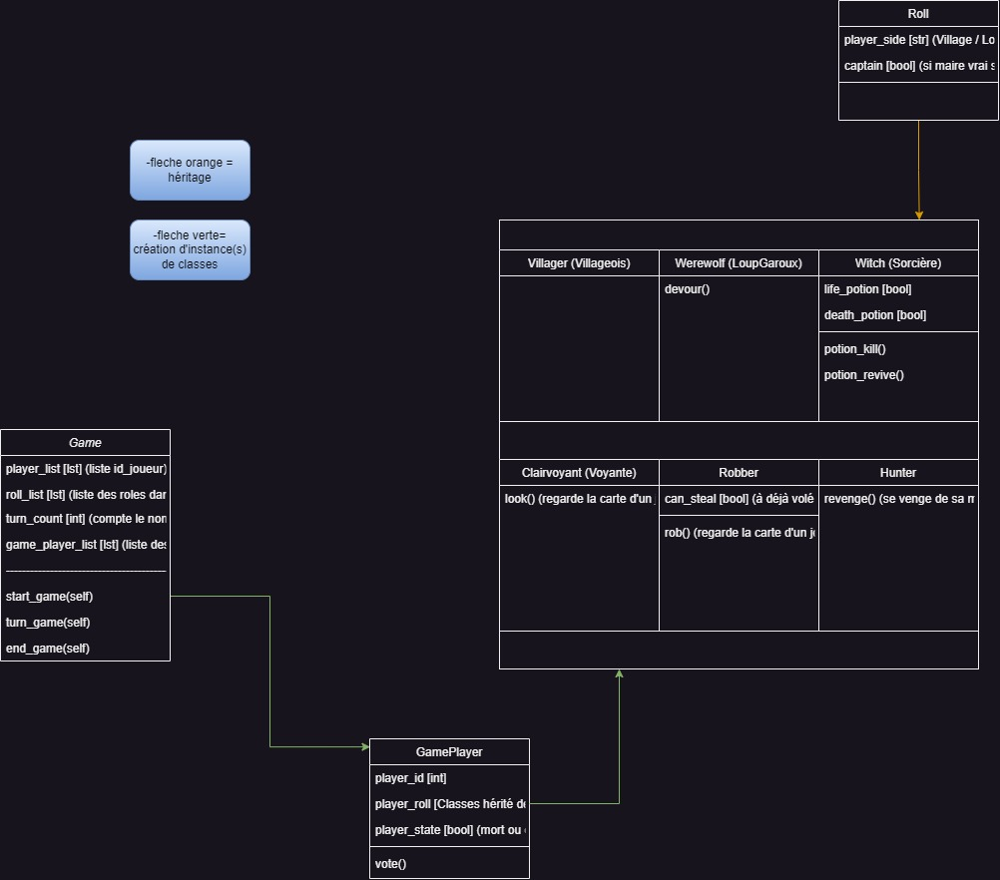

# 🐺Garoo, le meilleur des bots 😁👋🐺

#
# Garoo, c'est quoi ?
Garoo est un bot discord permettant de jouer au Loup Garou avec ses amis !
# Structure du Jeu
Le jeu peut être structurer en 3 parties:
- Pure-Jeu (Seulement le jeu sans rapport avec Discord ou la sauvegarde des donnés)
- Connecté avec pycord (Front)
- Gestion des données / serveurs (Back)

Voici la structure du côté Pure-Jeu:


# Comment utiliser Garoo-bot ?
Commencer d'abord par installer les fichiers (⚠️Il vous faut un compte github pour effectuer cette étape⚠️)

Installer la version de python suivante : https://www.python.org/downloads/release/python-3117/ . Suivez les instruction (installer maintenant) et gardez la localisation (dans un bloc-note où application de ce genre).

Puis une fois l'installation terminée. Vérrifier d'abord si vous avez pip (utilisé pour installer les bibliothèque pour faire fonctionner le bot).

Pour cela lancer l'éxécutable python.exe (trouvable à l'endroit que vous avez sauvegarder précédement), puis lancez la commmande suivante :

Si vous étes sur Windows :
-  ```py -m ensurepip```

Sinon :
- ```python -m ensurepip```
Cela devrait ne rien si pip et bel et bien installé avec python sinon il sera installer (cette action ne nécésite pas internet pour être faite)

Ensuite dans le même terminal (celui de python.exe) et installer la librairie Pycord 2.4 avec la commande suivante :
Pour Windows :
- ```py -m pip install py-cord==2.4```

Et pour UNIX/MacOS :
- ```python -m pip install py-cord==2.4```

Il ne vous reste plus qu'a lancer le fichier `main.py`

# Specs
- Python 3.11.7
- Pycord 2.4

# Joueur en plus disponible pour les tests
discorotino	discoro_.0.1	DEUX.468

# LISTE DE ROUTE 08/02/2024
COURT TERME:
-> Fonction trouver les nouveaux morts / résuscité via la différence de l'enseigne données sur les joueurs FAIT

-> Envoyer des messages seullement au Loups pour qu'ils sachent qui a été voté par leurs coéquipier / peuvent parler entre eux. TITOUAN

-> Le meme probleme que pour les Loups mais pour les roles, il faut recevoir son role (pq pas une commande pour voir son role ou un message privée) TITOUAN

-> Faire des asserts de préconditions et bien documenté le code 

-> Faire un .md propre

-> Si il ne reste plus que deux joueurs (Changer réélire par le maire choisies un prédécesseur) RAYAN

-> Permettre de choisir si l'on veut rejoindre la partie qui vient d'être créer. HUGO Attente (TITOUAN DE LA FONCTION)

LONG TERMES:
-> Rajouter le reste des rôles
-> Faire de meilleurs visions graphiques pour discord via l'api, effet de texte, petite barre a coté...

EN +:
-> Créer une image avec PIL pour animer un peu plus le bot discord (par exemple si quelqu'un meurt)
-> Plusieurs langues de disponibles 
